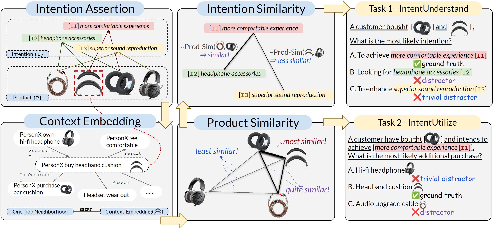

# IntentionQA: A Benchmark for Evaluating Purchase Intention Comprehension Abilities of Large Language Models in E-commerce

This is the official code and data repository for the paper **IntentionQA: A Benchmark for Evaluating Purchase Intention Comprehension Abilities of Large Language Models in E-commerce**.
The QA dataset for both tasks can be downloaded from `/data`.



## 1. filter
Preprocess the intention assertions and product data.

`filterAssertItem.py`: Preprocess the source data from FolkScope and filter out those with low typicality score and remove redundant assertions.

`simplifyName.py`: Conceptualize the original product names to short names with ChatGPT.

`findNode_aser`: Align nodes in ASER to purchasing events of products. 
## 2. negativeSampling
Get negative distractors for each problem in the following order.

`getEmbedding.py`: Get the embedding of each products leveraging their corresponding purchase eventuality nodes in ASER.

`computeSimilarity.py`: Compute the product-similarity and intention-similarity.

`getDistractor.py`: Sample negative distractors for each problem.

`QA_format.py`: Convert the raw data into QA format by inserting the gold answer to the distractors, and more.


## 3. evaluation
Conduct experiments with LLMs and evaluate the performance.

`askLM_task1.py`: Prompt LLMs for Task 1 - IntentUnderstand.

`askLM_task2.py`: Prompt LLMs for Task 2 - IntentUtilize.

`computeACC.py`: Compute the accuracy for the responses with problems of varying difficulties.

<!-- 4. finetune -->

## 4. Citing this Work

Please use the bibtex below for citing our paper:

```bibtex
@misc{ding2024INTENTIONQA,
      title={IntentionQA: A Benchmark for Evaluating Purchase Intention Comprehension Abilities of Large Language Models in E-commerce}, 
      author={Wenxuan Ding and
              Weiqi Wang and
              Sze Heng Douglas Kwok and 
              Minghao Liu and
              Tianqing Fang and
              Jiaxin Bai and
              Xin Liu and
              Changlong Yu and
              Zheng Li and
              Chen Luo and 
              Bing Yin and
              Junxian He and
              Yangqiu Song},
      year={2024},
      eprint={},
      archivePrefix={arXiv},
      primaryClass={cs.CL}}
```